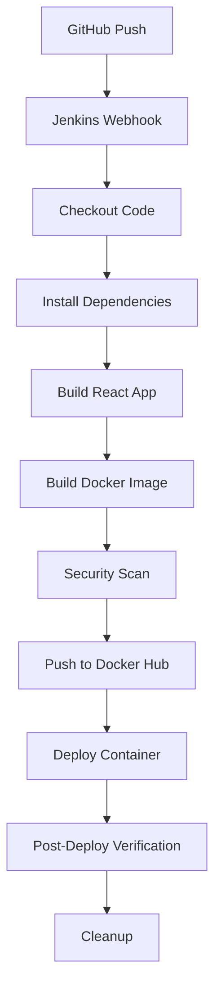

# Complete CI/CD Pipeline for React Application

This repository contains a comprehensive CI/CD setup for a React application with Docker containerization and Jenkins automation.

## 📁 Repository Structure

```
CI_CD/
├── 🐳 Docker Configuration
│   ├── Dockerfile                 # Multi-stage production build
│   ├── .dockerignore             # Files to exclude from Docker context
│   └── docker-compose.yml        # Multi-service Docker setup
│
├── ⚙️ CI/CD Pipeline
│   ├── Jenkinsfile               # Complete Jenkins pipeline
│   └── jenkins-setup.md          # Jenkins configuration guide
│
├── 🚀 Deployment Tools
│   ├── deploy.sh                 # Automated deployment script
│   └── nginx-proxy.conf          # Nginx reverse proxy config
│
├── 📱 React Application
│   ├── package.json              # Node.js dependencies
│   ├── public/
│   │   ├── index.html            # Main HTML template
│   │   └── manifest.json         # PWA manifest
│   └── src/
│       ├── index.js              # React entry point
│       ├── App.js                # Main component
│       ├── index.css             # Global styles
│       └── App.css               # Component styles
│
└── 📖 Documentation
    ├── README.md                 # Docker setup guide
    ├── jenkins-setup.md          # Jenkins configuration
    └── CI-CD-Overview.md         # This file
```

## 🔄 CI/CD Workflow Overview

### Automated Pipeline (Jenkins)


### Manual Deployment Options
```bash
# Quick deployment
./deploy.sh deploy

# Full pipeline
./deploy.sh full

# Docker Compose
docker-compose up -d
```

## 🐳 Docker Architecture

### Multi-Stage Build Benefits:
- **Build Stage**: Node.js 18 Alpine (~1.2GB) - Downloads dependencies and builds React app
- **Production Stage**: nginx Alpine (~25MB) - Serves static files
- **Size Reduction**: 98% smaller final image
- **Security**: No Node.js in production, minimal attack surface

### Container Features:
✅ **Optimized nginx configuration**  
✅ **Gzip compression**  
✅ **Security headers**  
✅ **Health checks**  
✅ **Static asset caching**  
✅ **React Router support**  

## ⚙️ Jenkins Pipeline Stages

### 1. **Checkout** 🔄
- Pulls latest code from GitHub
- Displays build information
- Sets up workspace

### 2. **Install Dependencies & Build** 📦
- Cleans previous builds
- Runs `npm ci` for reproducible installs
- Builds React app with `npm run build`
- Verifies build output

### 3. **Build Docker Image** 🐳
- Creates optimized Docker image
- Tags with build number and `latest`
- Shows image information

### 4. **Docker Security Scan** 🔍
- Analyzes image layers
- Checks for vulnerabilities
- Reports image size

### 5. **Push to Docker Hub** 📤
- Authenticates with Docker Hub
- Pushes tagged and latest images
- Confirms successful upload

### 6. **Deploy Locally** 🚀
- Stops/removes existing container
- Deploys new container
- Configures health checks
- Tests application response

### 7. **Post-Deploy Verification** ✅
- Monitors container health
- Checks resource usage
- Captures application logs

## 🛠 Deployment Script Features

The `deploy.sh` script provides multiple deployment options:

### Commands:
```bash
./deploy.sh build       # Build Docker image only
./deploy.sh deploy      # Build and deploy locally  
./deploy.sh push        # Build and push to Docker Hub
./deploy.sh full        # Complete pipeline
./deploy.sh clean       # Clean up resources
./deploy.sh logs        # Show container logs
./deploy.sh status      # Container status
./deploy.sh stop        # Stop container
./deploy.sh restart     # Restart container
```

### Options:
```bash
-i, --image NAME        # Custom Docker image name
-c, --container NAME    # Custom container name
-p, --port PORT         # Custom host port
-t, --tag TAG           # Custom image tag
```

## 🐙 Docker Compose Configuration

### Services Available:

#### 1. **react-app** (Main)
- Builds from local Dockerfile
- Exposes port 80
- Includes health checks
- Auto-restart enabled

#### 2. **nginx-proxy** (Optional)
- Reverse proxy for load balancing
- Additional security layers
- Custom routing rules
- Enable with: `docker-compose --profile proxy up`

#### 3. **redis** (Optional)
- Caching layer for performance
- Persistent data storage
- Enable with: `docker-compose --profile cache up`

#### 4. **postgres** (Optional)
- Database for full-stack apps
- Persistent data volumes
- Enable with: `docker-compose --profile database up`

## 🔧 Configuration Guide

### 1. Update Docker Hub Settings
Edit `Jenkinsfile`:
```groovy
environment {
    DOCKER_IMAGE_NAME = 'yashthakur1/react-app'
    DOCKER_CREDENTIALS_ID = 'your-dockerhub-credentials'
}
```

### 2. Configure Jenkins Credentials
1. Go to **Manage Jenkins** → **Manage Credentials**
2. Add Docker Hub credentials with ID: `dockerhub-credentials`
3. Add GitHub credentials (if private repository)

### 3. Set up Jenkins Pipeline
1. Create new Pipeline job
2. Point to your GitHub repository
3. Set Script Path to `Jenkinsfile`

### 4. Customize Deployment Script
```bash
# Environment variables
export DOCKER_IMAGE_NAME="yashthakur1/react-app"
export CONTAINER_NAME="my-react-app"
export HOST_PORT="8080"
```

## 🚀 Quick Start Guide

### 1. **Local Development**
```bash
# Install dependencies
npm install

# Start development server
npm start

# Build for production
npm run build
```

### 2. **Docker Build & Run**
```bash
# Build Docker image
docker build -t my-react-app .

# Run container
docker run -p 3000:80 my-react-app
```

### 3. **Using Deployment Script**
```bash
# Make executable
chmod +x deploy.sh

# Deploy locally
./deploy.sh deploy -p 3000

# Full pipeline with push
./deploy.sh full -i myusername/myapp
```

### 4. **Docker Compose**
```bash
# Basic deployment
docker-compose up -d

# With all services
docker-compose --profile proxy --profile cache --profile database up -d
```

## 🔍 Monitoring & Debugging

### Container Logs
```bash
# Using deployment script
./deploy.sh logs

# Direct Docker command
docker logs react-app-container --follow
```

### Container Status
```bash
# Using deployment script
./deploy.sh status

# Docker commands
docker ps
docker stats react-app-container
```

### Health Checks
```bash
# Check application health
curl http://localhost:80/

# Check container health
docker inspect react-app-container --format='{{.State.Health.Status}}'
```

## 🔒 Security Features

### Container Security:
- Non-root user execution (optional)
- Security headers in nginx
- Minimal base image (Alpine)
- No secrets in image layers

### Pipeline Security:
- Credentials stored in Jenkins vault
- No hardcoded secrets
- Image vulnerability scanning
- Resource cleanup after builds

### Network Security:
- Isolated Docker networks
- Reverse proxy configuration
- HTTPS ready (with proper certificates)

## 📈 Performance Optimizations

### Build Optimizations:
- Multi-stage Docker builds
- Layer caching strategies
- Minimal production images
- Dependency optimization

### Runtime Optimizations:
- nginx gzip compression
- Static asset caching
- CDN-ready configuration
- Resource-efficient containers

### CI/CD Optimizations:
- Parallel pipeline stages
- Build artifact caching
- Incremental deployments
- Automated cleanup

## 🔄 Scaling Considerations

### Horizontal Scaling:
```bash
# Multiple container instances
docker-compose up -d --scale react-app=3

# Load balancer configuration
# nginx-proxy automatically handles load balancing
```

### Production Deployment:
- Use orchestration platforms (Kubernetes, Docker Swarm)
- Implement blue-green deployments
- Set up monitoring and alerting
- Configure automated backups

## 🐛 Troubleshooting

### Common Issues:

#### Build Failures
- Check Node.js version compatibility
- Verify package.json scripts
- Review dependency versions

#### Docker Issues
- Ensure Docker daemon is running
- Check user permissions for Docker
- Verify available disk space

#### Deployment Failures
- Check port availability
- Verify container resource limits
- Review network configurations

#### Jenkins Pipeline Issues
- Confirm credentials are configured
- Check Jenkins plugins are installed
- Verify webhook configurations

## 📚 Additional Resources

- [Docker Best Practices](https://docs.docker.com/develop/best-practices/)
- [Jenkins Pipeline Documentation](https://www.jenkins.io/doc/book/pipeline/)
- [nginx Configuration Guide](https://nginx.org/en/docs/)
- [React Deployment Guide](https://create-react-app.dev/docs/deployment/)

## 🤝 Contributing

1. Fork the repository
2. Create feature branch: `git checkout -b feature/amazing-feature`
3. Commit changes: `git commit -m 'Add amazing feature'`
4. Push to branch: `git push origin feature/amazing-feature`
5. Create Pull Request

## 📄 License

This project is licensed under the MIT License - see the LICENSE file for details.

---

🎉 **Your React application is now ready for production with a complete CI/CD pipeline!**