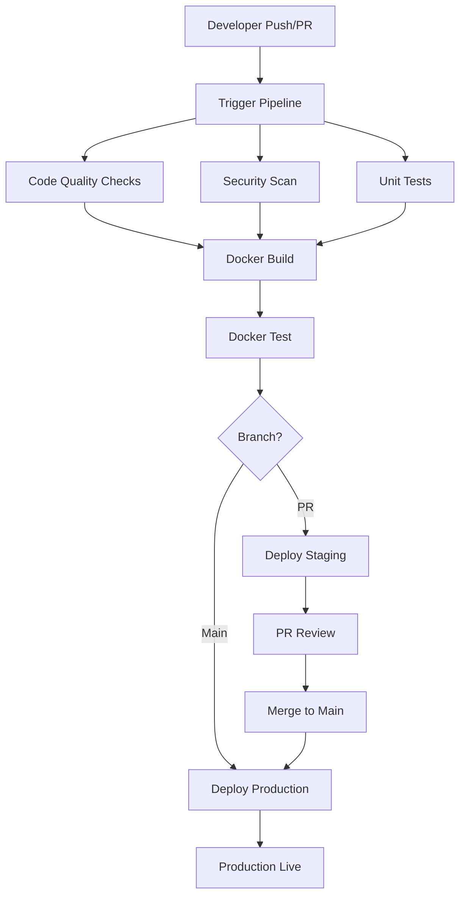

# 🚀 Automated CI/CD Pipeline Triggers

## Overview: Push/Pull Request Pipeline Automation

This guide shows how to set up automated pipelines that trigger on:
- **Git Push** to main/develop branches
- **Pull Requests** (code review automation)
- **Scheduled builds** (nightly/weekly)

## 🔄 Pipeline Trigger Options

### Option 1: Jenkins with Git Webhooks (Self-hosted)
### Option 2: GitHub Actions (Cloud-based)
### Option 3: GitLab CI (Alternative)

---

# 🔧 Option 1: Jenkins Pipeline with Webhooks

## Step 1: Configure Jenkins Pipeline Job

1. **Create Multibranch Pipeline:**
   - Jenkins → New Item → Multibranch Pipeline
   - Name: `react-app-ci-cd`

2. **Configure Branch Sources:**
   - **Source**: Git
   - **Repository URL**: `https://github.com/yashthakur1/react-docker-ci-cd.git`
   - **Credentials**: Your GitHub credentials
   - **Behaviors**: 
     - Discover branches (Strategy: All branches)
     - Discover pull requests from origin
     - Clean before checkout

3. **Build Configuration:**
   - **Mode**: by Jenkinsfile
   - **Script Path**: `Jenkinsfile`

## Step 2: Set Up GitHub Webhooks

1. **In your GitHub repository:**
   - Go to Settings → Webhooks → Add webhook
   - **Payload URL**: `http://your-jenkins-server:8080/github-webhook/`
   - **Content type**: application/json
   - **Events**: 
     - ✅ Pushes
     - ✅ Pull requests
     - ✅ Repository

2. **Test webhook** - Push a commit and watch Jenkins auto-trigger!

## Step 3: Enhanced Jenkinsfile for PR/Push Checks

```groovy
pipeline {
    agent any
    
    environment {
        DOCKER_IMAGE_NAME = 'yashthakur1/react-app'
        DOCKER_REGISTRY = 'docker.io'
        DOCKER_CREDENTIALS_ID = 'dockerhub-credentials'
        
        // Branch-specific configuration
        IS_MAIN_BRANCH = "${env.BRANCH_NAME == 'main'}"
        IS_PR = "${env.CHANGE_ID != null}"
        BUILD_TYPE = "${IS_PR.toBoolean() ? 'pull-request' : 'branch-build'}"
    }
    
    stages {
        stage('Pipeline Info') {
            steps {
                script {
                    echo """
                    🔍 Pipeline Trigger Information:
                    • Branch: ${env.BRANCH_NAME}
                    • Build Type: ${BUILD_TYPE}
                    • Is Pull Request: ${IS_PR}
                    • Is Main Branch: ${IS_MAIN_BRANCH}
                    • Change ID: ${env.CHANGE_ID ?: 'N/A'}
                    • Change Target: ${env.CHANGE_TARGET ?: 'N/A'}
                    """
                }
            }
        }
        
        stage('Code Quality Checks') {
            parallel {
                stage('Lint Check') {
                    steps {
                        script {
                            echo '🔍 Running ESLint checks...'
                            sh '''
                                npm ci --silent
                                npm run lint || echo "⚠️ Linting issues found"
                                # Create lint report
                                npm run lint -- --format json --output-file lint-results.json || true
                            '''
                        }
                    }
                    post {
                        always {
                            // Archive lint results
                            archiveArtifacts artifacts: 'lint-results.json', allowEmptyArchive: true
                        }
                    }
                }
                
                stage('Security Scan') {
                    steps {
                        script {
                            echo '🛡️ Running security audit...'
                            sh '''
                                # Audit dependencies for vulnerabilities
                                npm audit --audit-level high || echo "⚠️ Security vulnerabilities found"
                                npm audit --json > security-audit.json || true
                                
                                # Check for secrets in code
                                echo "🔍 Scanning for secrets..."
                                grep -r "password\|secret\|key\|token" src/ || echo "✅ No obvious secrets found"
                            '''
                        }
                    }
                    post {
                        always {
                            archiveArtifacts artifacts: 'security-audit.json', allowEmptyArchive: true
                        }
                    }
                }
                
                stage('Unit Tests') {
                    steps {
                        script {
                            echo '🧪 Running unit tests...'
                            sh '''
                                npm ci --silent
                                npm test -- --coverage --watchAll=false
                            '''
                        }
                    }
                    post {
                        always {
                            // Publish test results
                            publishTestResults testResultsPattern: 'junit.xml'
                            // Publish coverage report
                            publishCoverage adapters: [
                                istanbulCoberturaAdapter('coverage/cobertura-coverage.xml')
                            ], sourceFileResolver: sourceFiles('STORE_LAST_BUILD')
                        }
                    }
                }
            }
        }
        
        stage('Build & Test Docker Image') {
            steps {
                script {
                    echo '🐳 Building Docker image for testing...'
                    
                    def imageTag = IS_PR.toBoolean() ? 
                        "pr-${env.CHANGE_ID}-${env.BUILD_NUMBER}" : 
                        "branch-${env.BRANCH_NAME}-${env.BUILD_NUMBER}".replaceAll('/', '-')
                    
                    def dockerImage = docker.build("${DOCKER_IMAGE_NAME}:${imageTag}")
                    
                    echo "🧪 Testing Docker image..."
                    sh """
                        # Test container starts correctly
                        docker run -d --name test-container-${BUILD_NUMBER} -p 9999:80 ${DOCKER_IMAGE_NAME}:${imageTag}
                        
                        # Wait for startup
                        sleep 10
                        
                        # Health check
                        curl -f http://localhost:9999/ || exit 1
                        
                        # Cleanup test container
                        docker stop test-container-${BUILD_NUMBER}
                        docker rm test-container-${BUILD_NUMBER}
                        
                        echo "✅ Docker image test passed"
                    """
                    
                    env.DOCKER_IMAGE_TAG = imageTag
                }
            }
        }
        
        stage('Deploy to Staging') {
            when {
                // Only deploy PRs and main branch
                anyOf {
                    branch 'main'
                    expression { IS_PR.toBoolean() }
                }
            }
            steps {
                script {
                    echo '🚀 Deploying to staging environment...'
                    
                    def stagingPort = IS_PR.toBoolean() ? "808${env.CHANGE_ID}" : "8080"
                    def containerName = IS_PR.toBoolean() ? 
                        "react-app-pr-${env.CHANGE_ID}" : 
                        "react-app-staging"
                    
                    sh """
                        # Stop existing staging container
                        docker stop ${containerName} || true
                        docker rm ${containerName} || true
                        
                        # Deploy new version
                        docker run -d \\
                            --name ${containerName} \\
                            --restart unless-stopped \\
                            -p ${stagingPort}:80 \\
                            ${DOCKER_IMAGE_NAME}:${env.DOCKER_IMAGE_TAG}
                        
                        echo "🌐 Staging URL: http://localhost:${stagingPort}"
                    """
                    
                    // Update PR with staging URL
                    if (IS_PR.toBoolean()) {
                        echo "📝 PR staging environment ready at port ${stagingPort}"
                    }
                }
            }
        }
        
        stage('Production Deploy') {
            when {
                branch 'main'
                expression { !IS_PR.toBoolean() }
            }
            steps {
                script {
                    echo '🚀 Deploying to production...'
                    
                    // Push to Docker Hub
                    docker.withRegistry("https://${DOCKER_REGISTRY}", "${DOCKER_CREDENTIALS_ID}") {
                        def dockerImage = docker.image("${DOCKER_IMAGE_NAME}:${env.DOCKER_IMAGE_TAG}")
                        dockerImage.push()
                        dockerImage.push("latest")
                    }
                    
                    // Deploy to production
                    sh '''
                        # Blue-green deployment
                        docker stop react-app-prod || true
                        docker rm react-app-prod || true
                        
                        docker run -d \\
                            --name react-app-prod \\
                            --restart unless-stopped \\
                            -p 80:80 \\
                            ${DOCKER_IMAGE_NAME}:latest
                        
                        echo "✅ Production deployment completed"
                    '''
                }
            }
        }
    }
    
    post {
        always {
            script {
                // Clean up workspace
                cleanWs()
                
                // Clean up test images
                sh """
                    docker rmi ${DOCKER_IMAGE_NAME}:${env.DOCKER_IMAGE_TAG} || true
                    docker system prune -f
                """
            }
        }
        
        success {
            script {
                def message = IS_PR.toBoolean() ? 
                    "✅ Pull Request #${env.CHANGE_ID} checks passed! Staging: http://localhost:808${env.CHANGE_ID}" :
                    "✅ Build successful on branch ${env.BRANCH_NAME}"
                    
                echo message
                
                // Send notifications (Slack, email, etc.)
                // slackSend(channel: '#deployments', message: message)
            }
        }
        
        failure {
            script {
                def message = IS_PR.toBoolean() ?
                    "❌ Pull Request #${env.CHANGE_ID} checks failed!" :
                    "❌ Build failed on branch ${env.BRANCH_NAME}"
                    
                echo message
                
                // Send failure notifications
                // slackSend(channel: '#deployments', message: message, color: 'danger')
            }
        }
    }
}
```

---

# 🌟 Option 2: GitHub Actions (Recommended for Simplicity)

## Step 1: Create GitHub Actions Workflow

Create `.github/workflows/ci-cd.yml` in your repository:

```yaml
name: 🚀 React CI/CD Pipeline

on:
  # Trigger on push to main and develop
  push:
    branches: [ main, develop ]
  
  # Trigger on pull requests to main
  pull_request:
    branches: [ main ]
  
  # Allow manual trigger
  workflow_dispatch:

jobs:
  # Job 1: Code Quality & Testing
  quality-checks:
    runs-on: ubuntu-latest
    name: 🔍 Quality Checks
    
    steps:
    - name: 📥 Checkout code
      uses: actions/checkout@v4
      
    - name: 📦 Setup Node.js
      uses: actions/setup-node@v4
      with:
        node-version: '18'
        cache: 'npm'
        
    - name: 📋 Install dependencies
      run: npm ci
      
    - name: 🔍 Run ESLint
      run: npm run lint
      continue-on-error: true
      
    - name: 🛡️ Security audit
      run: npm audit --audit-level high
      continue-on-error: true
      
    - name: 🧪 Run tests
      run: npm test -- --coverage --watchAll=false
      
    - name: 📊 Upload coverage reports
      uses: codecov/codecov-action@v3
      with:
        token: ${{ secrets.CODECOV_TOKEN }}

  # Job 2: Docker Build & Test
  docker-build:
    runs-on: ubuntu-latest
    needs: quality-checks
    name: 🐳 Docker Build & Test
    
    outputs:
      image-tag: ${{ steps.meta.outputs.tags }}
    
    steps:
    - name: 📥 Checkout code
      uses: actions/checkout@v4
      
    - name: 🐳 Set up Docker Buildx
      uses: docker/setup-buildx-action@v3
      
    - name: 🏷️ Extract metadata
      id: meta
      uses: docker/metadata-action@v5
      with:
        images: yashthakur1/react-app
        tags: |
          type=ref,event=branch
          type=ref,event=pr
          type=sha,prefix={{branch}}-
          type=raw,value=latest,enable={{is_default_branch}}
          
    - name: 🔨 Build Docker image
      uses: docker/build-push-action@v5
      with:
        context: .
        push: false
        tags: ${{ steps.meta.outputs.tags }}
        labels: ${{ steps.meta.outputs.labels }}
        cache-from: type=gha
        cache-to: type=gha,mode=max
        
    - name: 🧪 Test Docker image
      run: |
        # Start container for testing
        docker run -d --name test-app -p 3000:80 yashthakur1/react-app:${{ github.sha }}
        
        # Wait for startup
        sleep 10
        
        # Health check
        curl -f http://localhost:3000/ || exit 1
        
        # Cleanup
        docker stop test-app
        docker rm test-app
        
        echo "✅ Docker image test passed"

  # Job 3: Deploy to Staging (PR preview)
  staging-deploy:
    runs-on: ubuntu-latest
    needs: docker-build
    if: github.event_name == 'pull_request'
    name: 🚀 Deploy PR Preview
    
    steps:
    - name: 🚀 Deploy to staging
      run: |
        echo "🌐 PR Preview would deploy to: https://pr-${{ github.event.number }}.staging.example.com"
        echo "This is where you'd deploy to your staging environment"

  # Job 4: Production Deploy (main branch only)  
  production-deploy:
    runs-on: ubuntu-latest
    needs: docker-build
    if: github.ref == 'refs/heads/main'
    name: 🌟 Production Deploy
    
    steps:
    - name: 📥 Checkout code
      uses: actions/checkout@v4
      
    - name: 🐳 Set up Docker Buildx
      uses: docker/setup-buildx-action@v3
      
    - name: 🔐 Login to Docker Hub
      uses: docker/login-action@v3
      with:
        username: ${{ secrets.DOCKER_USERNAME }}
        password: ${{ secrets.DOCKER_PASSWORD }}
        
    - name: 🏷️ Extract metadata
      id: meta
      uses: docker/metadata-action@v5
      with:
        images: yashthakur1/react-app
        tags: |
          type=ref,event=branch
          type=sha,prefix=main-
          type=raw,value=latest
          
    - name: 🚀 Build and push to Docker Hub
      uses: docker/build-push-action@v5
      with:
        context: .
        push: true
        tags: ${{ steps.meta.outputs.tags }}
        labels: ${{ steps.meta.outputs.labels }}
        cache-from: type=gha
        cache-to: type=gha,mode=max
        
    - name: 🌟 Deploy to production
      run: |
        echo "🚀 Production deployment completed"
        echo "🌐 App available at: https://your-production-domain.com"

  # Job 5: Notifications
  notify:
    runs-on: ubuntu-latest
    needs: [quality-checks, docker-build]
    if: always()
    name: 📢 Notifications
    
    steps:
    - name: 📢 Success notification
      if: ${{ needs.quality-checks.result == 'success' && needs.docker-build.result == 'success' }}
      run: |
        echo "✅ Pipeline completed successfully!"
        
    - name: 📢 Failure notification  
      if: ${{ needs.quality-checks.result == 'failure' || needs.docker-build.result == 'failure' }}
      run: |
        echo "❌ Pipeline failed. Check the logs for details."
```

## Step 2: Configure GitHub Secrets

Go to your GitHub repository → Settings → Secrets and variables → Actions

Add these secrets:
- `DOCKER_USERNAME`: Your Docker Hub username
- `DOCKER_PASSWORD`: Your Docker Hub access token  
- `CODECOV_TOKEN`: For code coverage (optional)

---

# 🎯 What Each Pipeline Checks

## ✅ Automated Checks on Every Push/PR:

### 🔍 Code Quality:
- **ESLint**: Code style and potential issues
- **Prettier**: Code formatting consistency
- **TypeScript**: Type checking (if using TS)

### 🛡️ Security:
- **npm audit**: Dependency vulnerabilities
- **Secret scanning**: No hardcoded secrets
- **Docker image scanning**: Container vulnerabilities

### 🧪 Testing:
- **Unit tests**: Component and function tests
- **Integration tests**: API and database tests  
- **E2E tests**: Full application flow (optional)

### 🐳 Docker:
- **Build validation**: Dockerfile builds successfully
- **Image testing**: Container starts and responds
- **Size optimization**: Image size within limits

### 🚀 Deployment:
- **Staging deploy**: PR preview environments
- **Production deploy**: Main branch auto-deploy
- **Rollback capability**: Quick revert on issues

---

# 🔧 Quick Setup Commands

## For Jenkins:
```bash
# 1. Create GitHub repository
git init
git add .
git commit -m "Initial commit with CI/CD pipeline"
git remote add origin https://github.com/yashthakur1/react-docker-ci-cd.git
git push -u origin main

# 2. Configure Jenkins job
# 3. Set up GitHub webhook
# 4. Push changes and watch automation!
```

## For GitHub Actions:
```bash
# 1. Create workflow directory
mkdir -p .github/workflows

# 2. Copy the ci-cd.yml content above
# 3. Add Docker Hub secrets in GitHub
# 4. Push to trigger pipeline!

git add .github/
git commit -m "Add GitHub Actions CI/CD pipeline"  
git push
```

---

# 📊 Expected Pipeline Flow



This setup gives you **enterprise-grade CI/CD automation** that:
- ✅ **Automatically checks every change**
- ✅ **Prevents bad code from reaching production**  
- ✅ **Provides instant feedback to developers**
- ✅ **Enables safe, automated deployments**
- ✅ **Maintains high code quality standards**

Choose Jenkins for self-hosted control or GitHub Actions for simplicity!